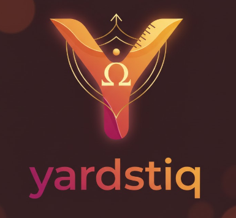

<p align="center"></p>

# Yardstiq (ys)

`yardstiq` is a python framework to ease quantum benchmarking.

It includes:
- Library to express custom algorithm and backend
- Package manager for benchmark, dataset and backend providers
- Command Line Interface (CLI) to run local or installed yardstiq-compatible packages

## Installation

```bash
pip install yardstiq yardstiq-compass
```

```bash
ys --help

ys qpu ls

ys benchmark run vqe --qpu=local/qiskit-aer
```